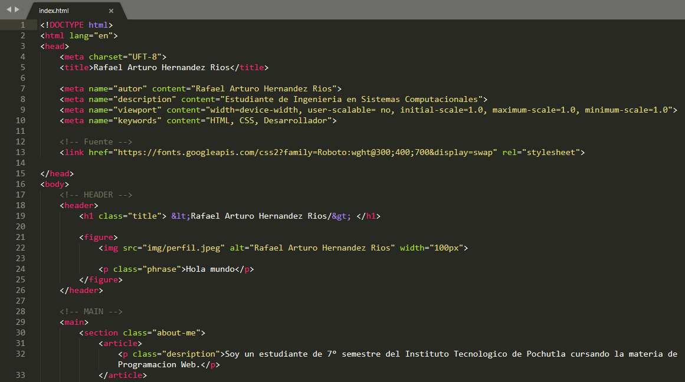
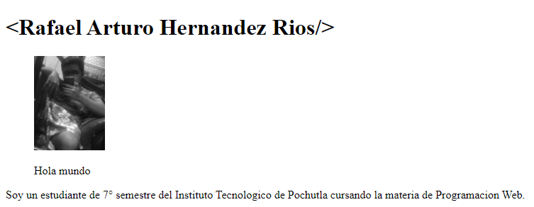
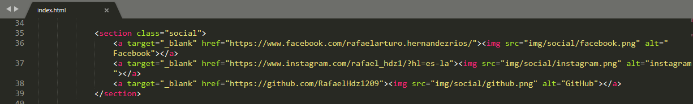
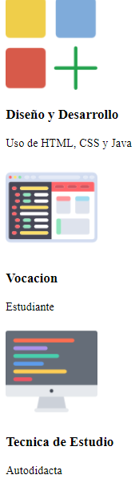
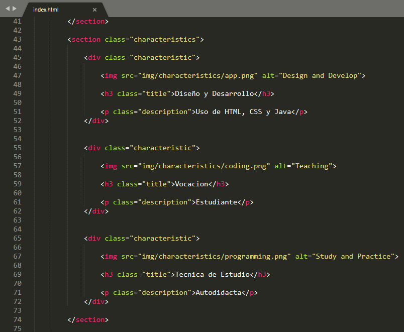

# PRACTICA 1 - PORTAFOLIO
# En la siguiente practica se llevó a cabo la elaboración de una pagina web estatica utilizando HTML.
# 1. Lo primero que realice fue la parte del header que quedo tal y como se muestra en las siguientes capturas.

# 2. A continuacion agregue un apartado de redes sociales, en el cual al hacer clic en cualquiera de las imagenes se redirigirá a su correspondiente URL.

# 3. Apartado de caracteristicas

